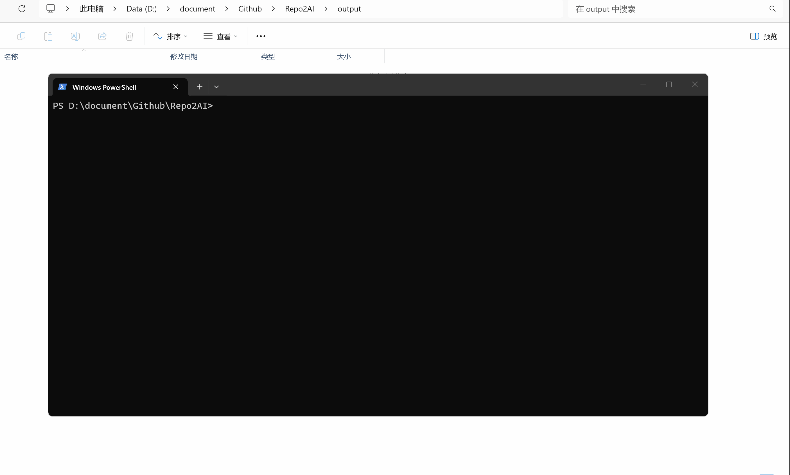

# Repo2AI

> Convert any code repository into AI-ready context packs in seconds.

🚀 Solve the "AI context too large" problem.

Repo2AI transforms your project into clean, structured, size-limited files that ChatGPT, Claude, Cursor and other AI tools can understand instantly.



---

## 🔥 Why Repo2AI?

Large repositories are hard to use with AI:

- Context too large
- Token limits exceeded
- Files messy and noisy
- AI cannot understand structure

👉 Repo2AI converts your repo into structured, chunked, AI-friendly context packs.

---

## 🎯 Use Cases

- Feed large projects into ChatGPT / Claude
- Prepare context for Cursor / Copilot
- Understand legacy systems with AI
- Share structured code context with teammates

---

## ⚡ What You Get

Instead of dumping raw code, Repo2AI generates:

output/
 ├── project-summary.md
 ├── controllers_01.md
 ├── services_01.md
 ├── entities_01.md
 ├── sql_01.md
 └── manifest.json

```
- Structured by code category
- Chunked to fit AI token limits
- Clean and noise-free
- Ready for copy-paste into AI tools

---

## ⚔️ Why Repo2AI over Repomix?

| Feature              | Repo2AI | Repomix |
|---------------------|--------|--------|
| AI-focused output   | ✅     | ❌     |
| Code classification | ✅     | ❌     |
| Chunk control       | ✅     | ⚠️     |
| Java optimization   | ✅     | ❌     |
| GUI support         | 🚧     | ❌     |

---

## ⬇️ Download

👉 https://github.com/fichil/Repo2AI/releases/latest

---

## ⚡ Quick Start

```bash
repo2ai scan ./my-project
```

------

## 📦 Installation

### Windows

Download the executable from Releases.

### Go Install

```
go install github.com/fichil/Repo2AI@latest
```

------

## 🛠️ Usage

### CLI

```
repo2ai scan ./demo
repo2ai scan ./demo --max-size=10mb
repo2ai scan ./demo --format=txt
```

### Parameters

| Parameter  | Description              |
| ---------- | ------------------------ |
| --max-size | Max size per output file |
| --format   | Output format (md / txt) |

------

## 🧠 How It Works

1. Scan repository
2. Classify files (Controller, Service, Entity, SQL, etc.)
3. Clean & filter irrelevant files
4. Split into size-limited chunks
5. Generate AI-ready context packs

------

## 🗺️ Roadmap

### v0.1 ✅

- Scan Java projects
- Generate AI-ready context packs
- Generate project-summary.md
- Generate manifest.json
- Split context packs by size
- Support Markdown and TXT
- Clean output before generation

### v0.2 (Next)

- GUI desktop app (Fyne)
- ZIP export
- Improved project summaries

### v0.3

- Spring Boot deep parsing
- Multi-language support (Go / Python)

------

## 🧩 Tech Stack

- Go (CLI engine)
- JavaParser (code analysis)
- Fyne (GUI, planned)

------

## 🤝 Contributing

PRs are welcome.

------

## ⭐ Star History

If this project helps you, give it a star.

------

## 📄 License

MIT
